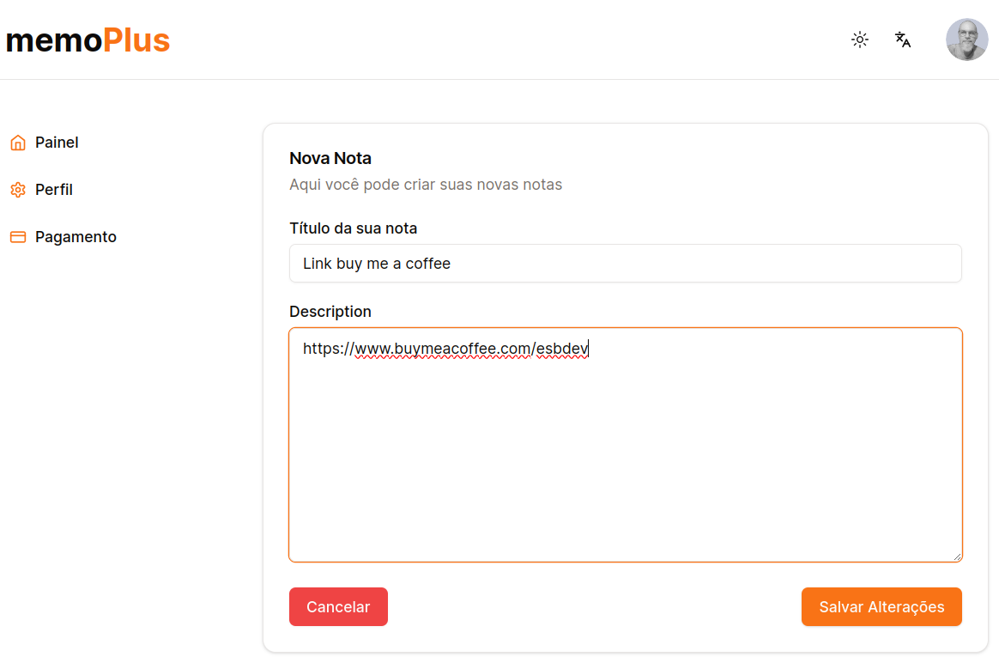

# Memo+

O Memo Plus e um modelo de aplicativo estilo SaaS, totalmente funcional, que provê um ambiente para gestão de anotações de notas. Nele você faz o registro na plataforma com e-mail ou autorização via rede social, google e Facebook. Após o registro a plataforma permite a assinatura do serviço de armazenamento individual de anotações. Como recursos adicionais temos o dark mode, a troca de tema e a troca de idioma.

Aos interessados, existe a possibilidade de substituir o serviço de anotação por qualquer outro tipo de serviço aproveitando a estrutura e os recursos já disponíveis. Este modelo foi elaborado justamente para montar esta estrutura inicial e aproveitá-la como template para outros projetos que estou desenvolvendo. Vale lembrar que esta versão inicial será em breve refatorada para a implementação de estruturas como Solid, DDD e testes.

deploy: <https://memo-plus.vercel.app>




## Pré-requisitos

- node (20.11.1 - utilizado)
- npm (10.2.4 - utilizado) ou gerenciador de biblioteca de sua preferência
- git (2.34.1 - utilizado)

## Techs

- React - linguagem de programação - <https://react.dev>
- Next 14 - framework - <https://nextjs.org>
- Typescript - tipagem - <https://www.typescriptlang.org>
- Shadcn ui - componentes - <https://ui.shadcn.com>
- Tailwind - estilização e ui - <https://tailwindui.com>
- Lucide-react - ícones - <https://lucide.dev/icons>
- Prisma - orm / persistência - <https://www.prisma.io>
- Next-intl - internacionalização - <https://next-intl-docs.vercel.app>
- Eslint - padronização, qualidade e estilo de código - <https://eslint.org>

[](#servicos)

## Serviço na web

- Supabase - gerenciador de banco de dados / postgress - <https://supabase.com>
- Kinde - autenticação - <https://kinde.com>
- Stripe - gateway de pagamento - <https://stripe.com/br>

## Instalar e Executar

1. Clone

   Escolha a pasta onde deseja armazenar o projeto e digite os comandos abaixo:

   ```
   git clone https://github.com/esbnet/example-saas.git
   ```

2. Instalar dependências

   Na pasta raiz do projeto, digite o seguinte comando:

   ```
   npm install
   ```

3. Configurar variáveis de ambiente

   Para que o sistema rode é necessário configurar as variáveis de ambiente. Para isso, deverá ser consultado a documentação de cada serviço utilizado. <a id="#servicos">Link acima</a>.
   Na pasta raiz, crie o arquivo `.env` e inclua as variáveis abaixo com seus respectivos valores.

```
# Kinde - Autenticação
KINDE_CLIENT_ID=
KINDE_CLIENT_SECRET=
KINDE_ISSUER_URL=
KINDE_SITE_URL=http://localhost:3000
KINDE_POST_LOGOUT_REDIRECT_URL=http://localhost:3000
KINDE_POST_LOGIN_REDIRECT_URL=http://localhost:3000/dashboard

# Supabase - Banco de dados
DATABASE_URL=
DIRECT_URL=

# Stripe - Gestão de Pagamento
STRIPE_SECRET_KEY=
STRIPE_PRICE_ID=
STRIPE_WEBHOOK_SECRET=
```

4. Criar banco de dados e tabelas

   É pré-requisito configurar as variáveis de ambiente para que o sistema tenha as credenciais de acesso ao Supabase.
   Na pasta raiz, digite:

   ```
   npx prisma migrate dev
   ```

   Este é o comando que criará o banco de dados e as tabelas no ambiente do Supabase.

5. Executar o projeto

   Ainda na pasta raiz do projeto, após realizar todos os procedimentos acima, rode o comando:

   ```
   npm run dev
   ```

---

<center>
Bons Estudos...
</center>

</br>
</br>
</br>

me pague um café (pix):


